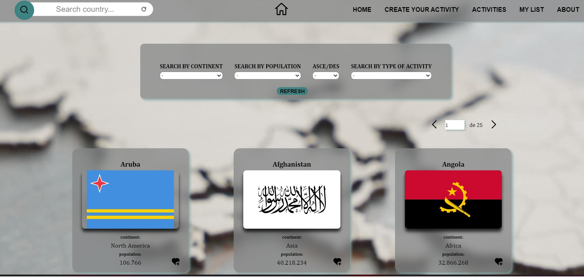
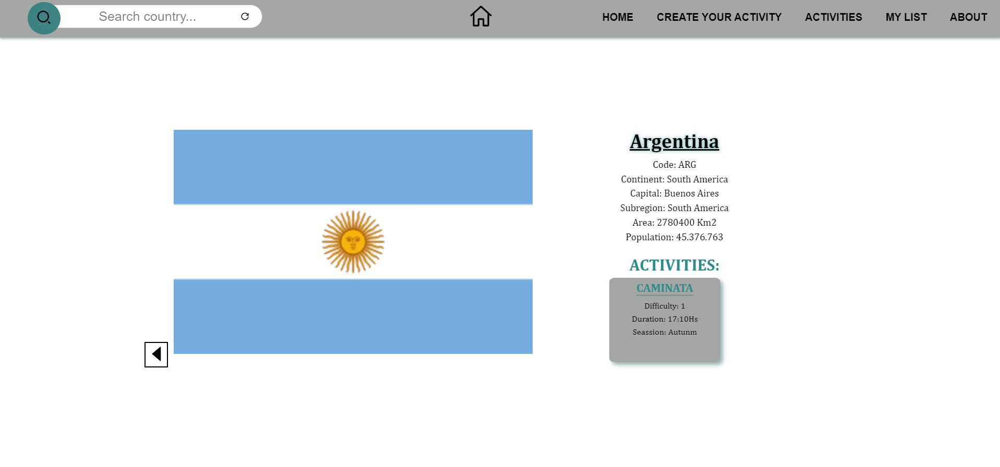
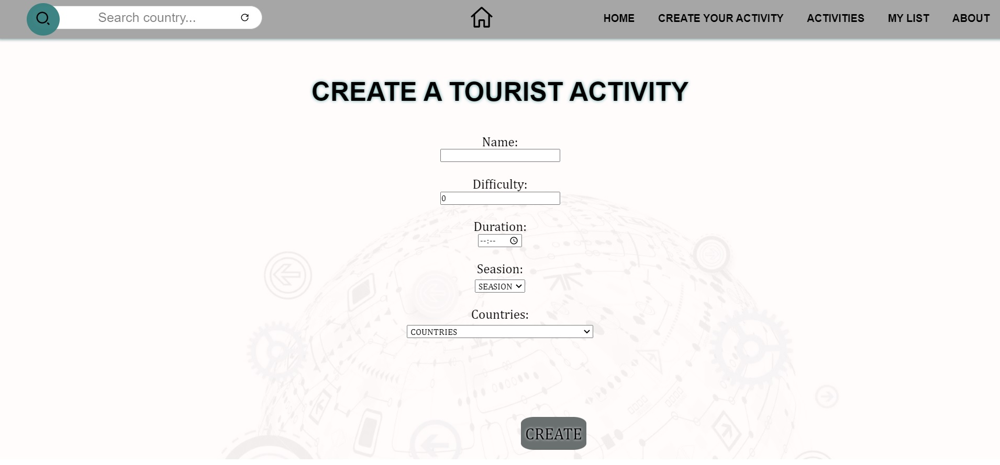
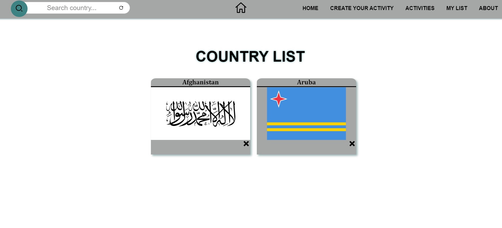
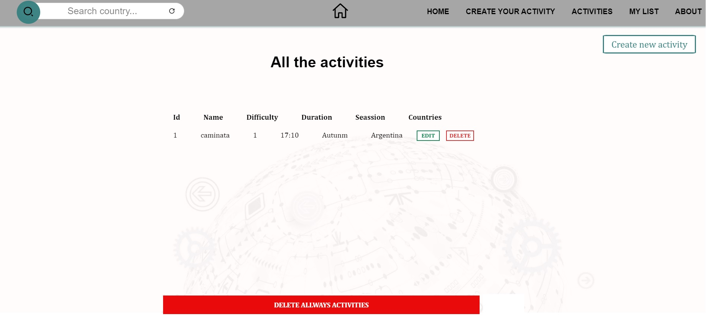
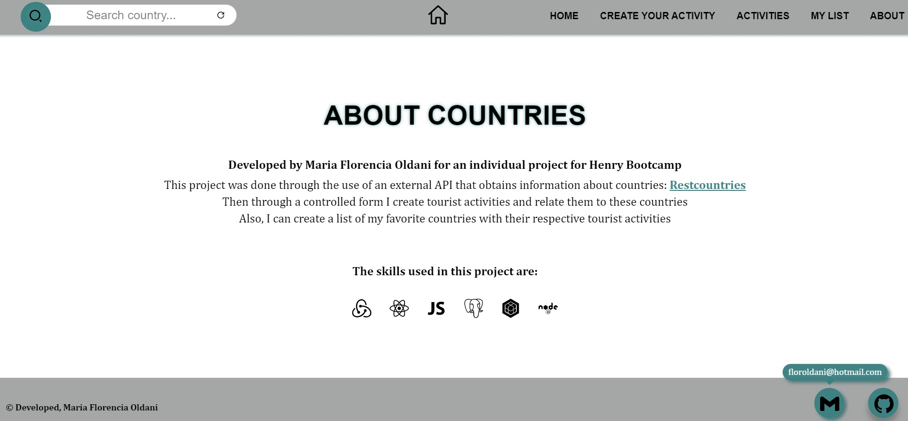

 
 
 <br />

#

# COUNTRIES APP

## Tecnologías utilizadas:

* __Javascript__
* __ReactJS__
* __Redux__
* __Hooks__
* __Css Puro__
* __Node.Js__
* __Express__
* __PostgreSQL / Sequelize__


<p align="left"> <a href="https://www.w3schools.com/css/" target="_blank" rel="noreferrer">  </a> <a href="https://expressjs.com" target="_blank" rel="noreferrer"> </a> <a href="https://developer.mozilla.org/en-US/docs/Web/JavaScript" target="_blank" rel="noreferrer">  </a> <a href="https://nodejs.org" target="_blank" rel="noreferrer">  </a> <a href="https://www.postgresql.org" target="_blank" rel="noreferrer">  </a> <a href="https://reactjs.org/" target="_blank" rel="noreferrer">  </a> <a href="https://es.redux.js.org/" target="_blank" rel="noreferrer">  </a> </p>


## Antes de empezar
Es necesario tener, al menos, la última versión estable de Node y NPM. Asegurese de tenerlas para instalar correctamente las dependencias necesarias para correr el proyecto.

Las versiones requeridas son:
- **Node**: 14.20 o superior
- **NPM**: 6.14 o superior

Para chequear que versiones tiene instaladas:
> node -v
>
> npm -v

## Instrucciones para correr el servidor de desarrollo
**ESTE REPOSITORIO SOLO ES EL FRONT DE LA APLICACION**

1. Clonar el repositorio
2. Correr los siguientes comandos:
```
npm install
npm start
```

3. Clonar el repositorio del back que esta en un repositorio aparte, llamado: "CountriesApp"


## Descripción
La aplicación tiene como finalidad poder buscar diferentes paises del mundo y entrar al detalle para mas informacion. Ademas, cuenta con un formulario controlado donde puedo crear distintas actividades turisticas y asociarlas a diferentes paises del mundo.
Cuenta con un CRUD entero con respecto a las actividades turisticas: se pueden crear, editar, eliminar y ver mas informacion de ellas. 


## Funcionalidades:

- Buscar diferentes paises del mundo
- Entrar a su detalle y ver informacion sobre el pais seleccionado y las actividades turisticas que tiene asociadas
- Buscar un pais en la barra de busqueda
- Filtrar paises por continente, poblacion y actividades
- Ordenar los paises de la A a la Z o al reves
- Recorrer las cards con el paginado
- Crear una actividad turistica mediante un formulario controlado y asociarla a un pais
- Editar actividades turisticas
- Eliminar actividades turisticas
- Guardar en la seccion de favoritos paises









## Deployment

La aplicación tiene el frontend en [NETLIFY](https://netlify.com)

[Link](https://countries-flor.netlify.app) para visitar la app.


